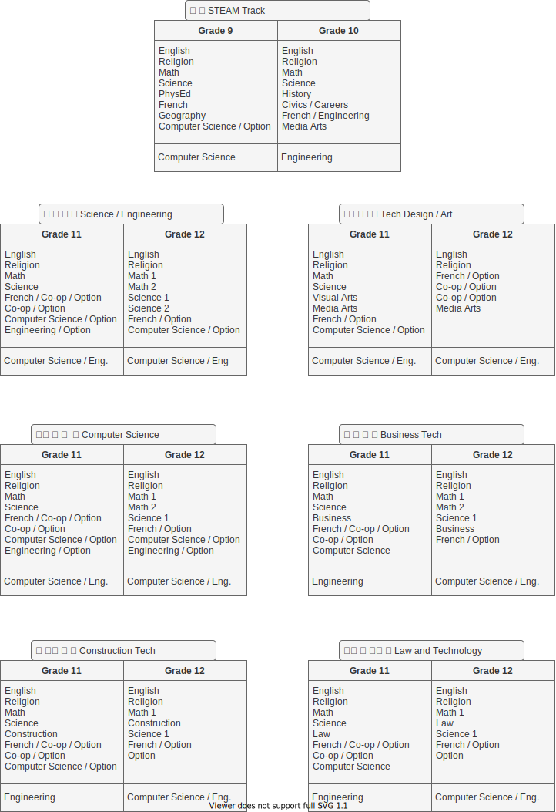

# STEAM

# (Science, Tech, Engineering, Art and Math)

## Formerly know as STEM (Science, Tech, Engineering and Math)

Grade 9 & 10 track to take, that will lead to University / College STEAM prep courses in grades 11 & 12.

